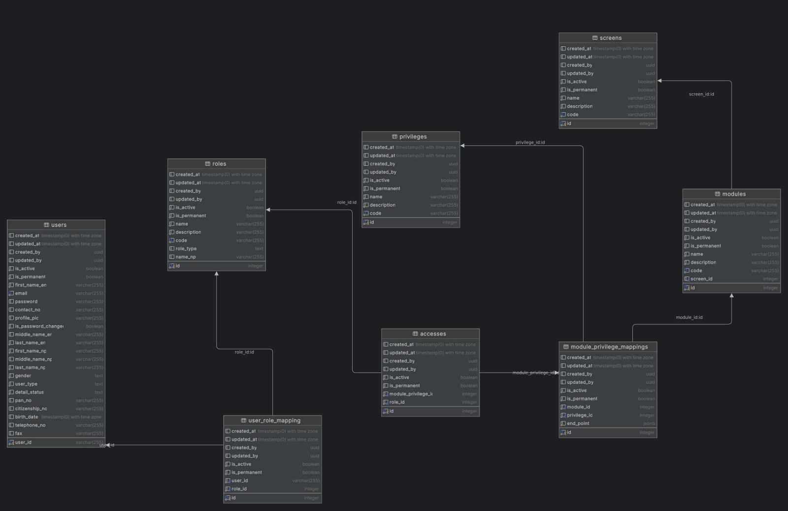

<p align="center">
  <a href="http://nestjs.com/" target="blank"></a>
</p>

[circleci-image]: https://img.shields.io/circleci/build/github/nestjs/nest/master?token=abc123def456
[circleci-url]: https://circleci.com/gh/nestjs/nest

  <p align="center">A progressive <a href="http://nodejs.org" target="_blank">Node.js</a> framework for building efficient and scalable server-side applications.</p>
    <p align="center">
<a href="https://www.npmjs.com/~nestjscore" target="_blank"></a>
<a href="https://www.npmjs.com/~nestjscore" target="_blank"></a>
<a href="https://www.npmjs.com/~nestjscore" target="_blank"></a>
<a href="https://circleci.com/gh/nestjs/nest" target="_blank"></a>
<a href="https://coveralls.io/github/nestjs/nest?branch=master" target="_blank"></a>
<a href="https://discord.gg/G7Qnnhy" target="_blank"></a>
<a href="https://opencollective.com/nest#backer" target="_blank"></a>
<a href="https://opencollective.com/nest#sponsor" target="_blank"></a>
  <a href="https://paypal.me/kamilmysliwiec" target="_blank"></a>
    <a href="https://opencollective.com/nest#sponsor"  target="_blank"></a>
  <a href="https://twitter.com/nestframework" target="_blank"></a>
</p>
  <!--[](https://opencollective.com/nest#backer)
  [](https://opencollective.com/nest#sponsor)-->

## Description
This project is a Role-Based Access Control (RBAC) system. RBAC is a policy-neutral access-control mechanism defined around roles and privileges. The components of RBAC such as role-permissions, user-role, and role-role relationships make it simple to perform user assignments.

- Users: This table stores information about the users who will be using the system. It typically includes fields like user_id, - username, password, email, etc.
- Roles: This table defines the various roles that exist within the system. For example, admin, editor, viewer, etc.
- User_Role_Mapping: This table is a many-to-many relationship table that maps users to their respective roles. A user can have multiple roles and a role can be assigned to multiple users.
- Modules: This table could represent different modules or sections of the application, like billing, inventory, HR, etc.
- Privileges: This table lists the various privileges or actions that can be performed, such as read, write, delete, etc.
- Module_Privilege_Mapping: This table is a many-to-many relationship table that maps which privileges are applicable to which modules.
- Screen: This table might represent the different screens or pages available in the application.
- Accesses: This table could define the access level or permissions a role has on a particular screen or module.

The system checks the role(s) of a user and determines the modules they can access and the operations they can perform. This kind of system is common in applications where you need to control the resources each user can access and the operations they can perform.


## Database Design



## Installation

```bash
$ npm install
```

## Running the app

```bash
# development
$ npm run start

# watch mode
$ npm run start:dev

# production mode
$ npm run start:prod
```

## Test

```bash
# unit tests
$ npm run test

# e2e tests
$ npm run test:e2e

# test coverage
$ npm run test:cov
```


